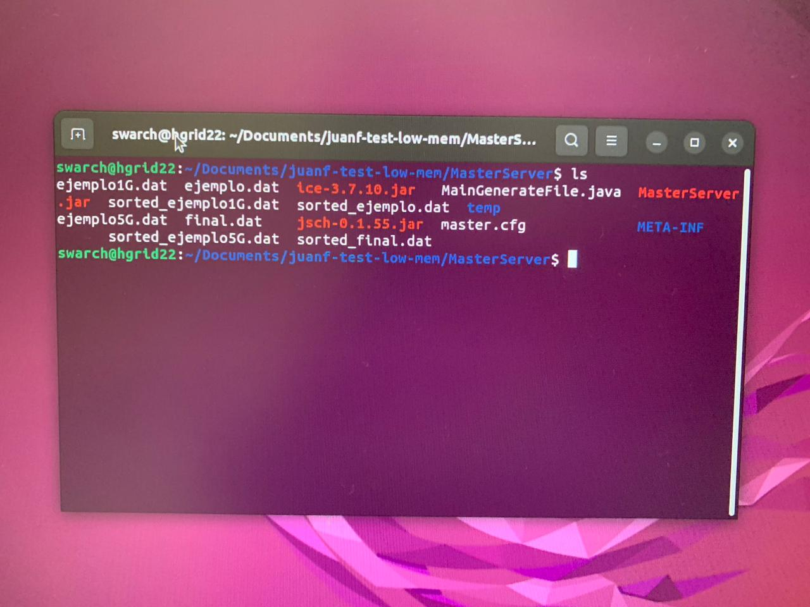
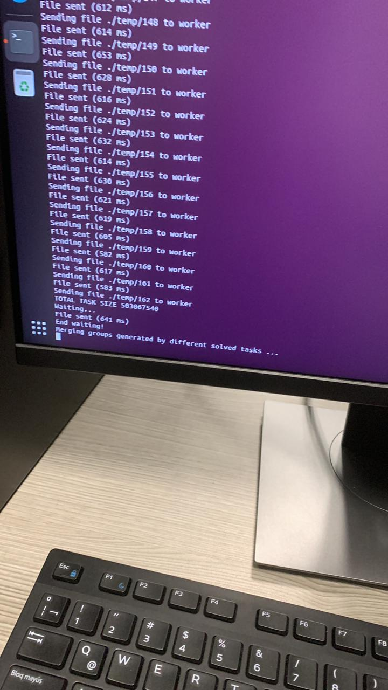

*Integrantes: Ariel Eduardo Pabón, Juan Fernando Martínez, Jesús Garcés, Juan Pablo Acevedo, Juan José Osorio.*

### Instrucciones de compilación y ejecución.

- Asegurarse que el proyecto esté configurado con Java 11 (en el caso de usar IntelliJ, revisar la configuración del proyecto) y con ICE 3.7.10 (en el caso de este último, se puede revisar en el archivo build.gradle).

- Ejecutar el comando 'gradlew build' dentro de la raíz del proyecto para compilar los JAR. Sus rutas son "../MasterServer/build/libs/MasterServer.jar" y "../WorkerServer/build/libs/WorkerServer.jar".

- Se deben configurar los archivos .cfg respectivos en cada JAR. Ambos necesitan el host del Master para funcionar. El Worker también necesita de su propio host.

- En cada JAR se debe configurar el archivo META-INF y poner el directorio del JAR de ICE 3.7.10. Esto implica que también hay que desplegar este componente.

- Para ejecutar cada JAR, se debe emplear el comando 'java -jar [Nombre del JAR]'.

- 500 millon strigs of 20 characters each: 42 minutes 

- 	
- 	
